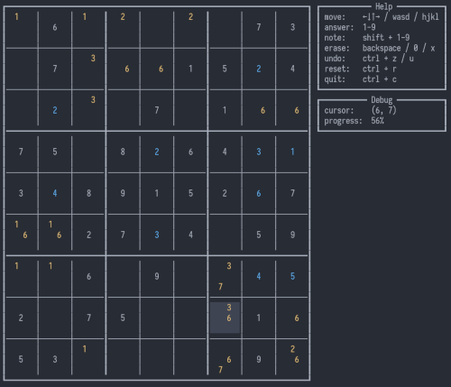

# sudoku-tui

Sudoku in the terminal using [`brick`](https://hackage.haskell.org/package/brick).

## Features

- Navigate the grid using Vim keys, WASD, or the arrow keys
- Fill in cells using the number keys
- Take notes using the number keys + Shift
- Load and save games using the menu
- Load games from a string of numbers (0 = blank)
- Games are autosaved when quitting without a filename

## Missing features
- Answer checking (sudoku solver)
- Randomly generated games
- TUI menu
- Real save format (currently just `show`s and `read`s the game state to a file)
